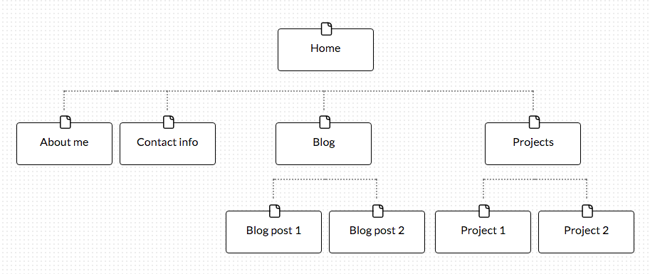

+ What are the 6 Phases of Web Design?

⋅⋅+ Information gathering
⋅⋅+ Planning
..* Design
..* Development
..* Testing and Delivery
..* Maintenance

+ What is your site's primary goal or purpose? What kind of content will your site feature?

My sight’s primary purpose is to share work history, background, passions, past projects and a blog.

+ What are your target audience's interests and how do you see your site addressing them?

My target audience is interested in learning about what I have to offer as a potential employee. My site will provide the information that they are looking for.

+ What is the primary "action" the user should take when coming to your site? Do you want them to search for information, contact you, or see your portfolio? It's ok to have several actions at once, or different actions for different kinds of visitors.

I’d like the user to have the ability to read about me, contact me, read my blog, or see my portfolio.

+ What are the main things someone should know about design and user experience?

User experience is how someone feels when interfacing with a system. UX designers attempt to maximize qualities including ease of use, perception of value, utility and efficiency.

+ What is user experience design and why is it valuable?

User experience design is the process of increasing user satisfaction by optimizing qualities including ease of use, perception of value, utility and efficiency. It is valuable because it can potentially increase the number of people willing to use a product or service.

+ Which parts of the challenge did you find tedious?

I did not find any parts of this challenge tedious. User experience design and site planning seem to be an integral part of web design.

1. First ordered list item
2. Another item
⋅⋅* Unordered sub-list. 
1. Actual numbers don't matter, just that it's a number
⋅⋅1. Ordered sub-list
4. And another item.

⋅⋅⋅You can have properly indented paragraphs within list items. Notice the blank line above, and the leading spaces (at least one, but we'll use three here to also align the raw Markdown).

⋅⋅⋅To have a line break without a paragraph, you will need to use two trailing spaces.⋅⋅
⋅⋅⋅Note that this line is separate, but within the same paragraph.⋅⋅
⋅⋅⋅(This is contrary to the typical GFM line break behaviour, where trailing spaces are not required.)
