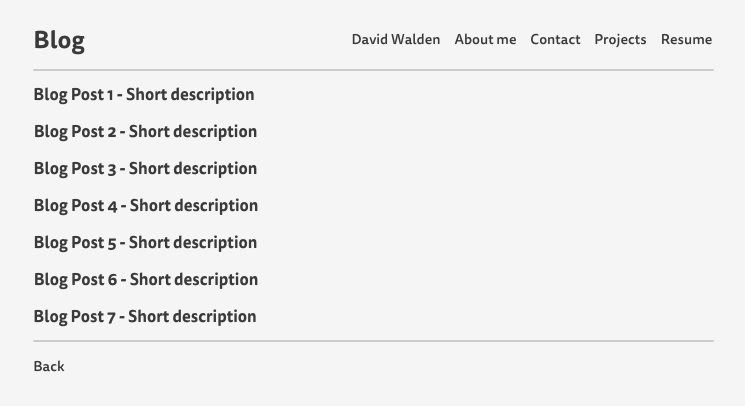

- What is a wireframe?

A wireframe is a visual guide that serves as an outline for the layout of a website.

- What are the benefits of wireframing?

Wireframes help web developers by allowing them to create an outline of the elements they want to include in a website. They can design the layout and determine how a user will navigate a website before ever having to write any code. Developers can focus on the overall design before delving into the technical details.

- Did you enjoy wireframing your site?

I did enjoy wireframing my site. It helped me visualize and refine what I want the end product to look like.

- Did you revise your wireframe or stick with your first idea?

I revised my design significantly. At first I tried to make it look like the home page of a social network website, but then I decided to make it look more like a personal website home page.

- What questions did you ask during this challenge? What resources did you find to help you answer them?

I consulted Google to find out what the layout of a standard personal website looked like.

- Which parts of the challenge did you enjoy and which parts did you find tedious?

I found all parts of the challenge engaging. It was fun to see how graphic design plays a key role in planning the layout of a website.
