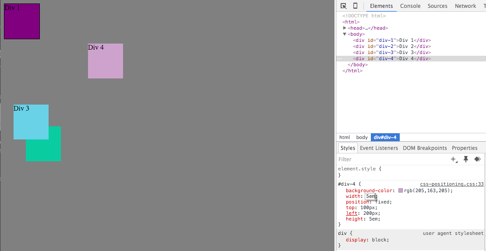
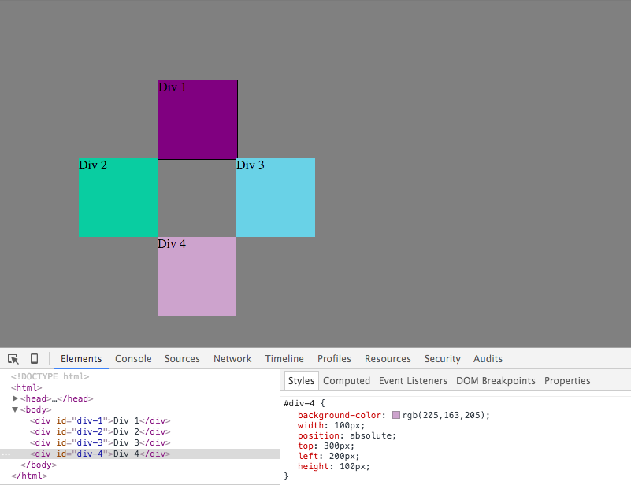

## Reflection 3.4
- How can you use Chrome's DevTools inspector to help you format or position elements?

Chrome’s DevTools inspector allows you to manipulate a webpage without altering the source HTML file. You can change the CSS to format or position elements on a webpage.

- How can you resize elements on the DOM using CSS?

You can resize elements on the DOM by altering elements such as height and width.

- What are the differences between absolute, fixed, static, and relative positioning? Which did you find easiest to use? Which was most difficult?

Static positioning is the default and it means that the element is positioned according to the normal flow of the page. Static elements are not affected by top, bottom, left, and right.

Absolute positioned elements are oriented relative to the nearest parent element. I found this positioning command the most useful.

Relative positioned elements are oriented relative their normal position. I found this one the most difficult to understand.

Fixed elements are positioned relative to the browser window. This means they remain stationary when scrolling.

- What are the differences between margin, border, and padding?

Margin defines the space between border and outside edge of the element.

The border is between the margin and padding.

Padding defines the space between content and border.

- What was your impression of this challenge overall? (love, hate, and why?)

I enjoyed this challenge because it introduced us to a new, useful tool.
