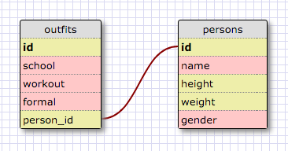

<!-- 1. Select all data for all states -->
SELECT * FROM states;

<!-- 2. Select all data for all regions -->
SELECT * FROM regions;

<!-- 3. Select the state_name and population for all states -->
SELECT state_name, population FROM states;

<!-- 4. Select the state_name and population for all states ordered by population -->
SELECT state_name, population FROM states
ORDER BY population DESC;

<!-- 5. Select the state_name for the states in region 7 -->
SELECT state_name FROM states WHERE
region_id = 7;

<!-- 6. Select the state_name and population_density for states with a population density over 50 ordered from least to most dense -->
SELECT state_name, population_density FROM states WHERE
population_density > 50
ORDER BY population_density;

<!-- 7. Select the state_name for states with a population between 1 million and 1.5 million people -->
SELECT state_name FROM states WHERE
population BETWEEN 1000000 AND 1500000;

<!-- 8. Select the state_name and region_id for states ordered by region in ascending order -->
SELECT state_name, region_id FROM states
ORDER BY region_id;

<!-- 9. Select the region_name for the regions with "Central" in the name -->
SELECT region_name FROM regions WHERE
region_name LIKE '%central%';

<!-- 10. Select the region_name and the state_name for all states and regions in ascending order by region_id. Refer to the region by name. (This will involve joining the tables) -->
SELECT region_name, state_name FROM regions, states WHERE
states.region_id = regions.id;

<!-- Schema Design -->

<!--
Reflection
- What are databases for?
Databases are used to organize collections of data. Databases allow users to access and modify stored data.

- What is a one-to-many relationship?
A one-to-many relationship is when two entities A and B are linked such that a single element of A may be linked to many elements of B, but one element of B is linked to only one element of A. One-to-many relationships adhere to the statements “___ belongs to a ___. ___ has many ___.”

- What is a primary key? What is a foreign key? How can you determine which is which?
A primary key is a key in a relational database that is unique for each record. A foreign key is a key from another table that refers to a primary key in the table being used. Foreign keys don’t have to be unique and they can accept null values.

- How can you select information out of a SQL database? What are some general guidelines for that?
You can select information out of a SQL database using the SELECT statement. You can select specific data by providing conditions.
-->