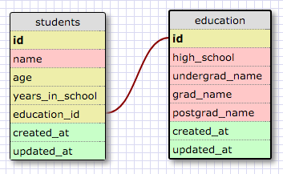
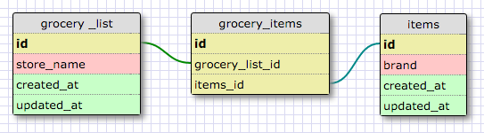

**One-to-one Relationships**

A one-to-one relationship is when two things have a single relationshipt to one another. A student can only have one educational history, and an educational history is linked to only one student.

**Many-to-many Relationships**

**Reflection**

- What is a one-to-one database?
Each element in a one-to-one database is linked to one other element to form a pair. The database is essentially comprised of paired elements.

- When would you use a one-to-one database? (Think generally, not in terms of the example you created).
You would use a one-to-one database to organize a dataset where each piece of data is linked to one other piece of data.

- What is a many-to-many database?
In a many-to-many database, one or more rows in one table can be related to zero, one, or many rows in another table. A third table called a join table is required to create a many-to-many database.

- When would you use a many-to-many database? (Think generally, not in terms of the example you created).
You would use a many-to-many database to organize sets of data with elements that are linked to multiple other elements.

- What is confusing about database schemas? What makes sense?
I’m still uncertain about how and when to use many-to-many databases. One-to-many and one-to-one databases make more sense to me.
